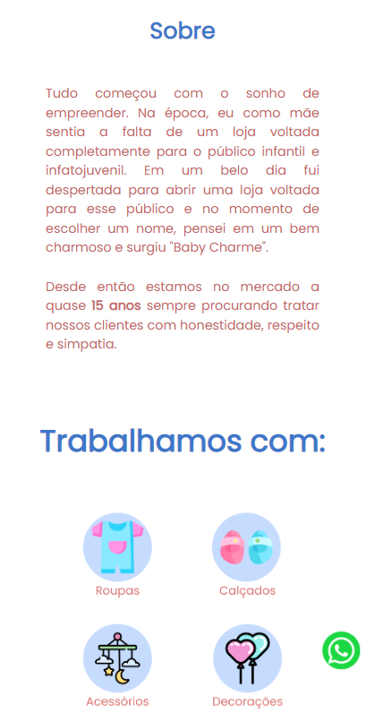
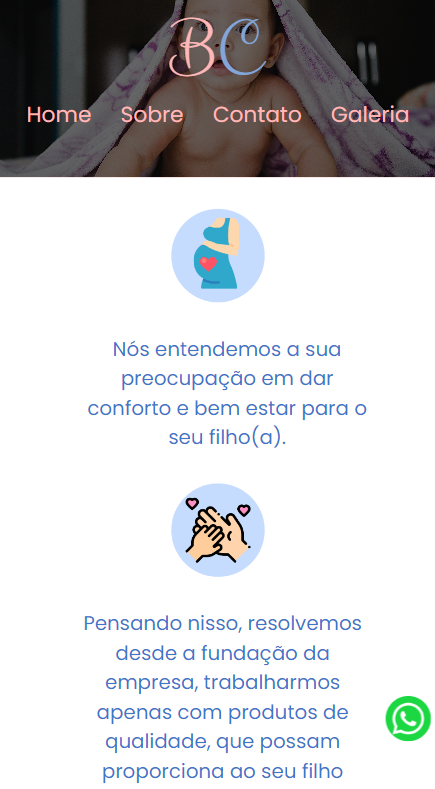

  

  
  
  

  

## 👨‍💻 Sobre o projeto:
<a href="https://kauasampaio96.github.io/SITE-LOJA/">Projeto Hospedado</a>

   O projeto foi construido com o intuito de testar conhecimentos de Html e Css em um <strong>site completo e responsivo</strong>. 
   Onde é apresentada uma Loja de artigos infantis visando tanto a apresentação da marca como meios de contato e conversão de novos clientes.

 

### 🚀 Tecnologias Utilizadas:

  </img>

